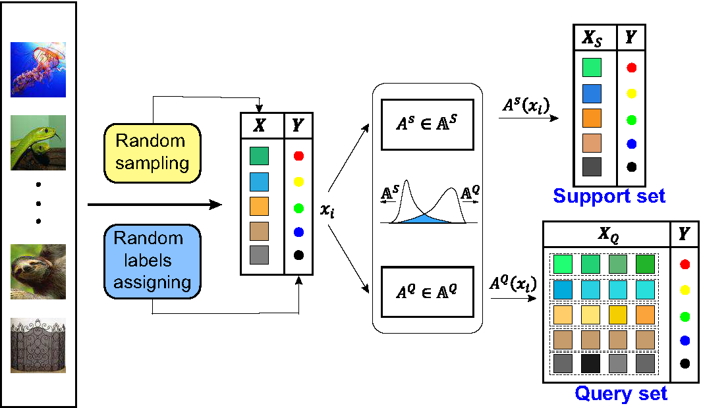

Unsupervised Few-shot Learning via Distribution Shift-based Augmentation
---

### Introduction
This reposity contains the official implementation for the paper:

[Unsupervised Few-shot Learning via Distribution Shift-based Augmentation](https://arxiv.org/abs/2004.05805)

Tiexin Qin, Wenbin Li, Yinghuan Shi and Yang Gao.

### Abstract
Few-shot learning aims to learn a new concept when only a few training examples are available, which has been extensively explored in recent years. However, most of the current works heavily rely on a large-scale labeled auxiliary set to train their models in an episodic-training paradigm. Such a kind of supervised setting basically limits the widespread use of few-shot learning algorithms, especially in real-world applications. Instead, in this paper, we develop a novel framework called \emph{Unsupervised Few-shot Learning via Distribution Shift-based Data Augmentation} (ULDA), which pays attention to the distribution diversity inside each constructed pretext few-shot task when using data augmentation. Importantly, we highlight the value and importance of the distribution diversity in the augmentation-based pretext few-shot tasks. In ULDA, we systemically investigate the effects of different augmentation techniques and propose to strengthen the distribution diversity (or difference) between the query set and support set in each few-shot task, by augmenting these two sets separately (\ie shifting). In this way, even incorporated with simple augmentation techniques (\eg random crop, color jittering, or rotation), our ULDA can produce a significant improvement. In the experiments, few-shot models learned by ULDA can achieve superior generalization performance and obtain state-of-the-art results in a variety of established few-shot learning tasks on \emph{mini}ImageNet and \emph{tiered}ImageNet. The source code is available in https://github.com/WonderSeven/ULDA.

### Dependencies
- Python 3.6+
- [PyTorch 1.2+](https://pytorch.org/)
- [torchnet 0.0.4](https://pypi.org/project/torchnet/)
- [PyYAML](https://pypi.org/project/PyYAML/)

### Useage

`cd Main/main.py`

`python main.py --config ../configs/miniImageNet/ULDA_5way1shot.yaml`

Note that: the files end with `.yaml`  in configs contains the hyper-papameters for our experiments. This project has been test in pycharm, if you run it directly, you may need to change the index relationship of many files.

### Citation    
If you use this code for your research, please cite our paper:

    @inproceedings{Qin2020ULDA,
    title={Unsupervised Few-shot Learning via Distribution Shift-based Augmentation},
    author={Tiexin Qin, Wenbin Li, Yinghuan Shi and  Gao Yang},
    booktitle={arxiv},
    year={2020}

